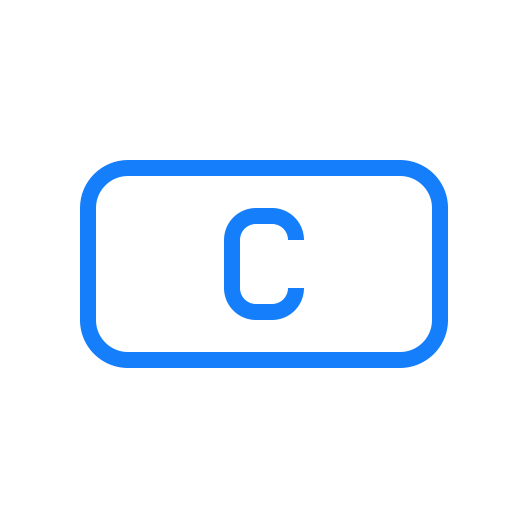

# About me
  Student. 
  Programmer. 
  Web Developer. 
  Want to work as SDE. 
  
## Learning
  &emsp;&emsp;
  &emsp;&emsp;
  &emsp;&emsp;  
  &emsp;&emsp;
  &emsp;&emsp;
  &emsp;&emsp;
  &emsp;&emsp;
  &emsp;&emsp;   
  &emsp;&emsp;
  &emsp;&emsp;
  &emsp;&emsp;
  &emsp;&emsp;
  &emsp;&emsp;
  &emsp;&emsp;

  
  
 
