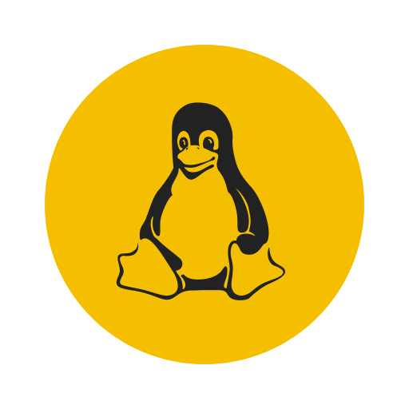

# About me
  Student. 
  Programmer. 
  
<!-- ## Tyring to learn...
  &emsp;&emsp;
  &emsp;&emsp;
  &emsp;&emsp;
  &emsp;&emsp;
  &emsp;&emsp;
  &emsp;&emsp;
  &emsp;&emsp;
  &emsp;&emsp;
  &emsp;&emsp;
  &emsp;&emsp;
  -->
## Current Work:
  Gaining knowledge in DSA.  
  In a path of Front-end Development followed by Full Stack Development.
    
  To reach me: 
  LinkedIn: https://www.linkedin.com/in/rampentapati1111/
  
  
 
